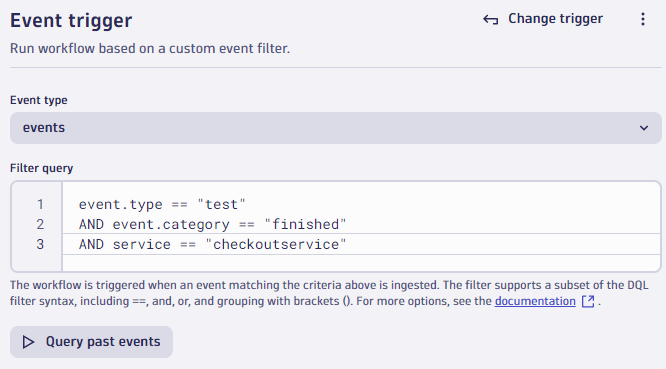
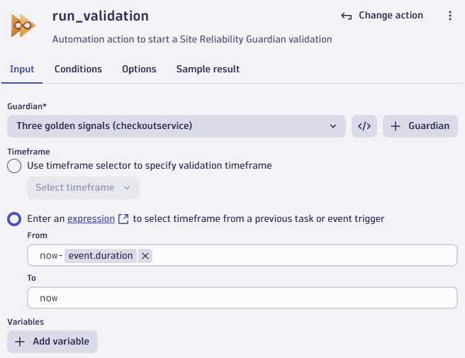

# Automate the Site Reliability Guardian

[Site reliability guardians](https://docs.dynatrace.com/docs/platform-modules/automations/site-reliability-guardian){target="_blank"} can be automated so they happen whenever you prefer (on demand / on schedule / event based). A [Dynatrace workflow](https://docs.dynatrace.com/docs/platform-modules/automations/workflows){target="_blank"} is used to achieve this.

In this demo:

* A load test will run and send a "load test finished" Software Delivery Lifecycle event into Dynatrace (see below).
* A Dynatrace workflow will react to that event and trigger a guardian.

Let's plumb that together now.

### Sample k6 teardown test finished event

This is already coded into the [demo load test script](https://github.com/dynatrace/obslab-release-validation/blob/main/.devcontainer/k6/k6-load-test-script.yaml#L38){target="_blank"}.

```javascript
export function teardown() {
    let post_params = {
      headers: {
        'Content-Type': 'application/json',
        'Authorization': `Api-Token ${__ENV.K6_DYNATRACE_APITOKEN}`
      },
    };

    let test_duration = 2m;

    // Send SDLC event at the end of the test
    let payload = {
      "event.provider": "k6",
      "event.type": "test",
      "event.category": "finished",
      "service": "checkoutservice",
      "duration": test_duration
    }
    let res = http.post(`${__ENV.K6_DYNATRACE_URL}/platform/ingest/v1/events.sdlc`, JSON.stringify(payload), post_params);
}
```

## Create a Workflow to Trigger Guardian

Ensure you are still on the `Three golden signals (checkoutservice)` screen.

* Click the `Automate` button. This will create a template workflow.
* Change the `event type` from `bizevents` to `events`.
* Change the `Filter query` to:

```
event.type == "test"
AND event.category == "finished"
AND service == "checkoutservice"
```

* Click the `run_validation` node.
* Remove `event.timeframe.from` and replace with:


```
now-{{ event()['duration'] }}
```


The UI will change this to `now-event.duration`.

* Remove `event.timeframe.to` and replace with:
```
now
```

* Click the `Save` button.

The workflow is now created and connected to the guardian. It will be triggered whenever the platform receives an event like below.





The workflow is now live and listening for events.

## [Click Here to Continue...](enable-auto-baselines.md)