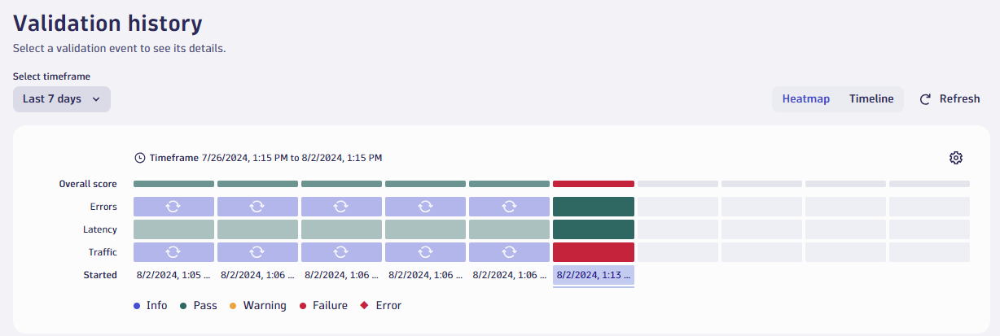

The preparation phase is now complete. Everything before now is a one-off task.

In day-to-day operations, you would begin from here.

## Run an Evaluation

Now that the Site Reliability Guardian is trained, run another evaluation by triggering a load test.

> Remember, the workflow is currently configured to listen for `test finished` events but you could easily create additional workflows with different triggers such as on-demand on time-based CRON triggers.

Run another load test to trigger a sixth evaluation.
```
kubectl apply -f .devcontainer/k6/k6.yaml
```

After about 90 seconds, `kubectl get jobs` should show:

```
➜ /workspaces/obslab-release-validation (main) $ kubectl get jobs
NAME               STATUS     COMPLETIONS   DURATION   AGE
k6-training-run1   Complete   1/1           102s       9m41s
k6-training-run2   Complete   1/1           100s       9m33s
k6-training-run3   Complete   1/1           101s       9m23s
k6-training-run4   Complete   1/1           93s        9m17s
k6-training-run5   Complete   1/1           91s        9m11s
run-k6             Complete   1/1           79s        81s

```

When this evaluation is completed, click the `Refresh` button in the `Validation history` panel of the site reliability guardian app (when viewing an individual guardian) and the heatmap should look like the image below

> Note: Your results may vary.

> In this example below, the `Traffic` objective failed because the auto-adaptive thresholds detected that a traffic level below `1171` requests is too low and the actual traffic level was `1158`.
> Because one objective failed, the guardian failed.

5 training runs and 1 "real" run:




### Setting Objectives to Informational Only

It is possible to add objectives that are "informational only" and do not contribute to the pass / fail decisions.

This is useful for new services where you are trying to "get a feel for" the real-world data values of your metrics.

To set an objective as "information only":

- Select the objective to open the side panel
- Scroll down to `Define thresholds`
- Select the `No thresholds` option


<div class="grid cards" markdown>
- [Click Here to Continue:octicons-arrow-right-24:](enable-change.md)
</div>