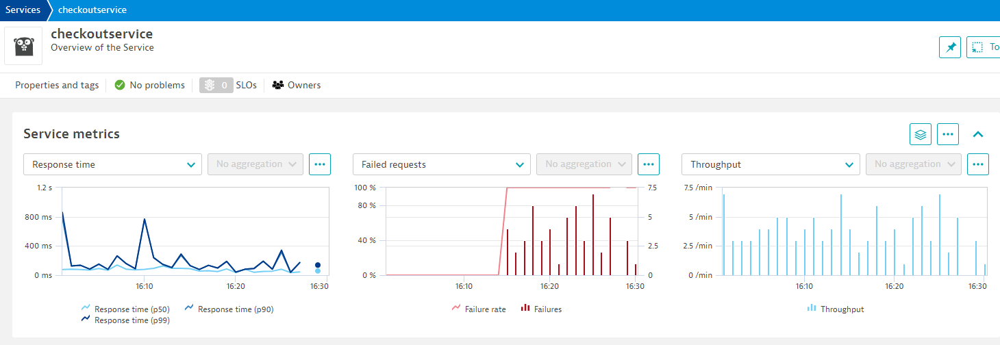
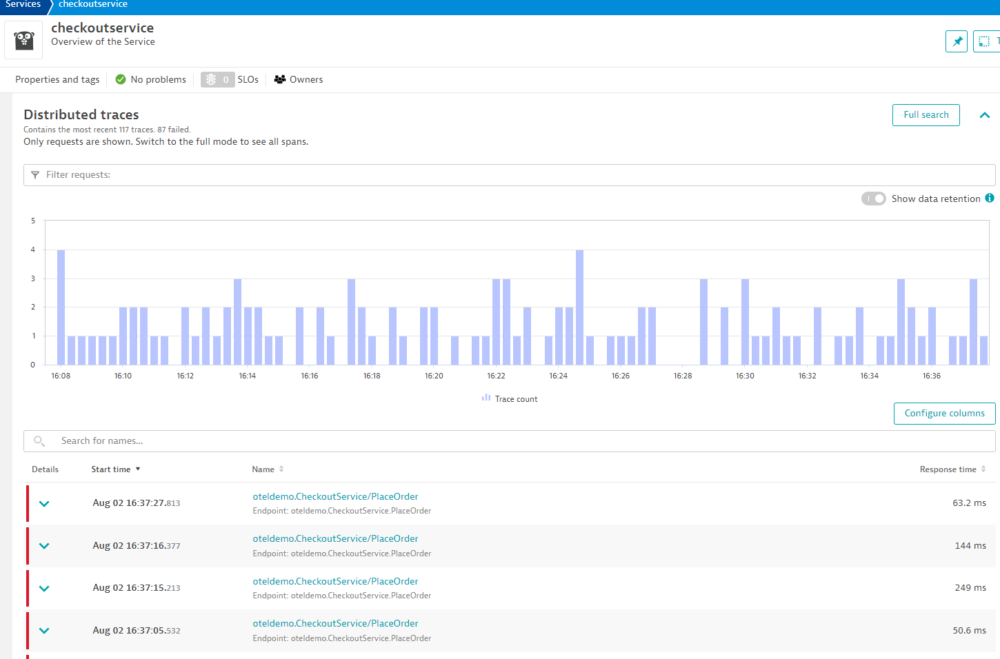
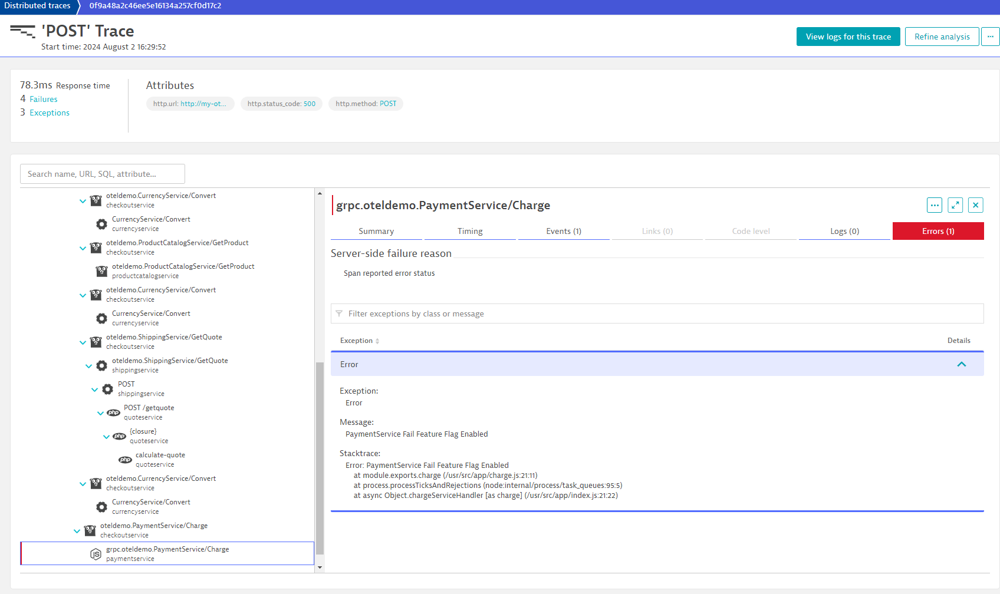

## View Data

After ~3 minutes, `kubectl get jobs` should show the `acceptance-load-test` to be `Complete`.

Refresh the Site Reliability Guardian results heatmap again and you should see that the guardian has failed.


The guardian has failed due to the error rate being too high.


Navigating to the `checkoutservice` (`ctrl + k` > `services` > `checkoutservice`), you can see the increase in failure rate.



Scroll down the services screen until you see the OpenTelemetry traces list. Notice lots of failed requests:



## Analyse a Failed Request



Drill into one of the failed requests and notice lots of failures.

These failures are bubbling up through the request chain back towards the checkoutservice.

Ultimately though, the failure comes from the final span in the trace: The call to `PaymentService/Charge`.

Investigating the span events the cause of the failure becomes clear: The payment service cuase an exception. The exception message and stacktrace is given:

```
exception.message	PaymentService Fail Feature Flag Enabled
exception.stacktrace	Error: PaymentService Fail Feature Flag Enabled at module.exports.charge
  (/usr/src/app/charge.js:21:11) at process.processTicksAndRejections
  (node:internal/process/task_queues:95:5) at async Object.chargeServiceHandler
  [as charge] (/usr/src/app/index.js:21:22)
exception.type	Error
```


## Roll Back Change

Roll back the change:

```
./runtimeChange.sh paymentServiceFailure off
```

## Summary

Looking back at the initial brief, it was your job to:

* Enable that feature flag in a development environment.
* Judge the impact (if any) of that change on the application.
* If an impact is observed, gather the evidence and then disable the feature flag.
* Make the "go / no go" decision for that feature.
* Provide feedback to the product managers on why you made the decision you did.

So how did things turn out?

* You have enabled a feature flag and send contextual event information to Dynatrace.
* You used OpenTelemetry and Dynatrace to make an evidence-based analysis of the new software quality.
* You have automated the change analysis, noticing an impact and remediated it.
* You have protected users by automating this analysis in a development environment (of course, you could repeat this setup in production too).
* You have made the `no go` decision based on evidence provided by OpenTelemetry and the Dynatrace Site Reliability Guardian.
* You can provide this evidence (down to the stacktrace and line of code) back to the product manager so they can prioritise fixes.

The Dynatrace Platform, Site Reliability Guardian and Workflows have provided visibility and automated change analysis.

## [Cleanup Resources >>](cleanup.md)